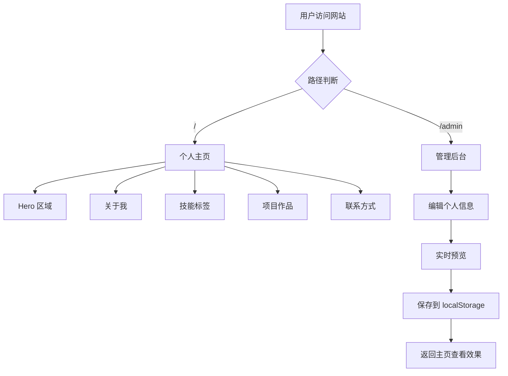

## 1. 产品概述

一个可在 Cloudflare Pages 上运行的个人主页，具备出色的视觉设计，并附带 `/admin` 路径下的信息编辑器。访客浏览精美的个人展示页，管理员通过 `/admin` 实时编辑个人信息并持久化到 localStorage。

- 目标用户：希望拥有一个高颜值个人主页的开发者/创作者
- 核心价值：零后端依赖、一键部署到 Cloudflare Pages、实时可视化编辑

## 2. 核心功能

### 2.1 用户角色

| 角色 | 说明 | 核心权限 |
|------|------|----------|
| 访客 | 无需登录 | 浏览个人主页所有内容 |
| 管理员 | 通过 /admin 路径进入 | 编辑所有个人信息并保存到 localStorage |

### 2.2 功能模块

1. **个人主页**：Hero 大图区、关于我、技能标签、项目作品、联系方式、社交链接
2. **管理后台 (/admin)**：表单编辑所有模块内容、实时预览、保存/重置功能

### 2.3 页面详情

| 页面名称 | 模块名称 | 功能描述 |
|----------|----------|----------|
| 个人主页 | Hero 区域 | 全屏渐变背景 + 打字机动效展示姓名和标语 |
| 个人主页 | 关于我 | 个人简介、照片、一段自我描述 |
| 个人主页 | 技能标签 | 技能名称 + 图标/标签云展示 |
| 个人主页 | 项目作品 | 项目卡片：标题、描述、技术栈标签、链接 |
| 个人主页 | 联系方式 | 邮箱、社交链接图标、联系表单（仅展示） |
| 管理后台 | 信息编辑器 | 左侧表单分类编辑，右侧实时预览缩略图 |
| 管理后台 | 保存与重置 | 保存到 localStorage，重置为默认值 |

## 3. 核心流程

访客流程：访问主页 → 浏览各区域内容 → 点击社交链接跳转

管理员流程：访问 /admin → 编辑各字段 → 实时预览 → 点击保存 → 数据写入 localStorage → 返回主页查看效果

## 4. 用户界面设计

### 4.1 设计风格

- **主色调**：深色主题，以近黑 (#0a0a0f) 为底，搭配明亮青绿色 (#00ffc8) 作为强调色
- **次色调**：暖金 (#f0c040) 用于次要高亮，柔白 (#e8e8f0) 用于文字
- **按钮风格**：圆角微透明玻璃态按钮（glassmorphism），hover 时发光
- **字体**：展示字体使用 Outfit（现代几何感），正文使用 DM Sans
- **布局风格**：全屏分段式滚动布局，每个模块占一屏或大半屏
- **动效**：滚动淡入动画、打字机效果、悬浮粒子背景、hover 微交互

### 4.2 页面设计概览

| 页面名称 | 模块名称 | UI 元素 |
|----------|----------|---------|
| 个人主页 | Hero 区域 | 全屏渐变 + Canvas 粒子背景、大号姓名、打字机标语、向下箭头 |
| 个人主页 | 关于我 | 左侧圆形头像、右侧简介文字、渐变分割线 |
| 个人主页 | 技能标签 | 网格布局的玻璃态卡片、图标 + 技能名 |
| 个人主页 | 项目作品 | 横向滚动或网格项目卡片、悬停展开描述 |
| 个人主页 | 联系方式 | 社交图标行、邮箱链接、底部 Footer |
| 管理后台 | 编辑器 | 左右分栏：左侧折叠式表单、右侧等比缩略预览 |

### 4.3 响应式设计

- 桌面优先设计，适配 1440px+ 宽度
- 平板端（768-1024px）管理后台切换为上下布局
- 移动端（<768px）所有内容单列展示，导航收缩为汉堡菜单

### 4.4 数据存储

- 所有个人信息存储在浏览器 localStorage 中
- 首次访问使用内置默认数据
- 管理后台编辑后保存即时生效
- 提供导出/导入 JSON 功能（方便备份和迁移）
