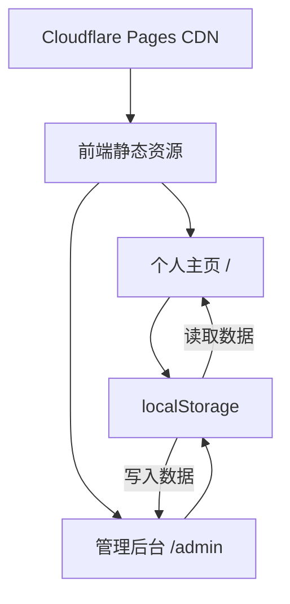

## 1. 架构设计



纯前端架构，无后端服务。所有数据通过 localStorage 持久化，Cloudflare Pages 托管静态资源。

## 2. 技术说明

- **前端**：React 18 + TypeScript + Tailwind CSS 3 + Vite
- **初始化工具**：vite-init (react-ts 模板)
- **后端**：无
- **数据库**：localStorage（浏览器本地存储）
- **状态管理**：Zustand（管理编辑器状态 + 数据持久化中间件）
- **路由**：react-router-dom v6
- **动画**：Framer Motion
- **图标**：lucide-react
- **部署**：Cloudflare Pages（静态站点）

## 3. 路由定义

| 路由 | 用途 |
|------|------|
| `/` | 个人主页，展示所有个人信息 |
| `/admin` | 管理后台，编辑个人信息 |

## 4. 数据模型

### 4.1 数据结构定义

```typescript
interface PersonalData {
  hero: {
    name: string;
    taglines: string[];       // 打字机循环展示的标语
    avatar: string;           // 头像 URL
  };
  about: {
    bio: string;              // 自我描述
    location: string;
  };
  skills: {
    name: string;
    icon: string;             // lucide 图标名
    category: string;
  }[];
  projects: {
    title: string;
    description: string;
    tags: string[];
    link: string;
    image: string;
  }[];
  contact: {
    email: string;
    socials: {
      platform: string;
      url: string;
      icon: string;
    }[];
  };
}
```

### 4.2 存储方案

- **存储键**：`personal-site-data`
- **首次加载**：检测 localStorage 中是否存在数据，不存在则使用默认内置数据
- **保存策略**：管理后台点击保存时，将整个 PersonalData 对象序列化写入 localStorage
- **导出/导入**：支持将数据导出为 JSON 文件下载，以及从 JSON 文件导入恢复

## 5. Cloudflare Pages 部署配置

- **构建命令**：`npm run build`
- **输出目录**：`dist`
- **SPA 路由**：需配置 `_redirects` 文件，内容为 `/* /index.html 200`，确保客户端路由正常
- **Node 版本**：18+
